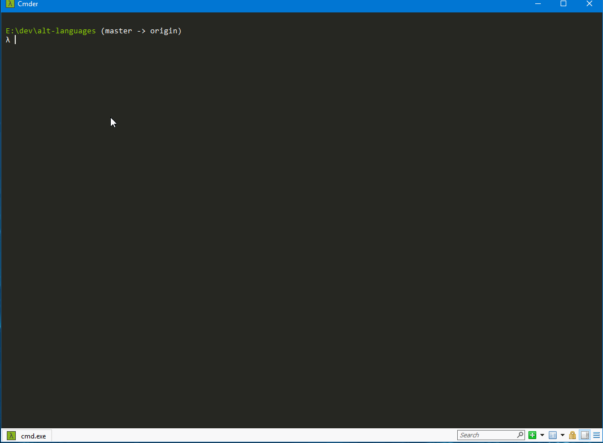

# alt-languages

Alternative programming languages sandbox

## Alternative Programming Languages: If you're not looking, you should be

### So why this talk

As game devs (and tool developers) we tend to have a stable of programming languages that we're comfortable with
and always fall back to.$$

However, they may not always be the best choices, for the problems we're trying to solve.

This talk delves into two languages that are becoming more and more popular amongst the 'trendy, hipster crowd' of
milennieal programmers.

I kid, these are languages that I've played with and they have their possible use-cases in our day to day work.

### The Languages We Will Discuss

There's a number of languages out there that we use from day to day:

- C#
- C++ (many versions from 03 - 17 ... and beyond)
- Python

I was recently asked by a friend on EAX to get some stats on the Frostbite codebase. So I ran [`cloc`](https://github.com/AlDanial/cloc) to get some stats.
It's kind of cool what I ended up with:

``` bash
github.com/AlDanial/cloc v 1.78  T=2978.00 s (33.8 files/s, 8629.2 lines/s)
---------------------------------------------------------------------------------------
Language                             files          blank        comment           code
---------------------------------------------------------------------------------------
C++                                  23511        1325624         634394        6039739
C#                                   30020        1015165         594132        5382443
C/C++ Header                         30000         787327         754998        3006891
XML                                   1814           9203           4346        1655242
Python                                6107         285932         367301        1283276
C                                      975          77634         157799         473858
MSBuild script                         578              8            655         402884
XAML                                  1633          13141           7930         177115
JavaScript                             966          26249          46756         165891
HTML                                   579          14012           1697         121786
NAnt script                           1694           7774           3071          85468
Tcl/Tk                                 317          11287          20950          63776
XSD                                     42            426            168          62515
Bourne Shell                            94           8228           9827          49447
Lua                                    144           4005           3028          33993
Java                                    55           8603           5878          32820
Markdown                               255          10834              0          32618
TypeScript                             113           6814          27855          27237
m4                                      27           3034            422          26811
CSS                                     86           3247            878          25458
Fortran 77                              51             17          13727          24137
JSON                                   191              4              0          22273
Assembly                                59           4034           3226          19865
ActionScript                           238           3312           4486          17195
Pascal                                 120           1717          70944          11263
CMake                                  104           1766           1905           6742
Gencat NLS                             162             31              0           6437
HLSL                                    94           1526           1023           6348
DOS Batch                              288           1737            393           5962
Objective C++                           31           1409           1417           5560
Perl                                    19            956           1049           4365
Qt                                       6              0              0           4030
CUDA                                    14            681            173           2768
make                                    52            685            623           2736
Objective C                             15            552            601           2319
YAML                                    30            103            320           2155
ANTLR Grammar                            6            299             29           1876
yacc                                     1            373            290           1859
TeX                                      7             16             16           1820
SQL                                     11            188             16           1600
SWIG                                     2            267             49           1306
INI                                     24            242             82           1247
Windows Resource File                   22            407            525           1210
Windows Module Definition               12           1098            110           1062
Visual Basic                            14            291            232            923
ASP                                     10            118              5            724
PHP                                      3             64              0            723
Ant                                      9            126            183            501
GLSL                                     3             70             73            474
Mako                                    10             92             11            409
MXML                                     1             78             11            333
XSLT                                     5             44             24            330
lex                                      1             80            174            324
Go                                       2             70            101            314
Ruby                                     6             99             40            288
ASP.NET                                  8              8              0            271
Bourne Again Shell                       9             48             39            221
WiX source                               1             21             12            127
F#                                       8             24              0            126
vim script                               1             35             29            119
PowerShell                               4             21             14            110
LESS                                     2             18              7             94
IDL                                      1              4              0             60
MATLAB                                   1              8              7             57
Fish Shell                               1             11             13             50
DTD                                      2              6              0             42
Protocol Buffers                         1             40            128             42
RobotFramework                           1              1              1             24
C Shell                                  1              9              7             21
sed                                      1              4              4             13
---------------------------------------------------------------------------------------
SUM:                                100675        3641357        2744204       19312123
---------------------------------------------------------------------------------------
```

To say that we're a C++/C#/Python organization would be a falsehood, to say the least.

And looking at that table, one can readily see that we're actually using one of the language I'll be talking about already! GoLang.

Thus, this talk, and the languages we'll be discussing: Rust and GoLang (or Go)

## Before we go too far

A language is only as good as it's tools. Neither of the languages we're going to look at comes with an IDE.

What we'll be using is [Visual Studio Code](https://code.visualstudio.com). I cannot say enough good things about it. But I'll let it speak for itself.

This does not mean that it is the only option. However it is the easiest to integrate and has the lowest barrier of entry.

## Rust

You can find a great starting point for Rust at [Rust-lang](www.rust-lang.org). It's a great starting point and has links to all
the learning materials you'd ever want.

From Wikipedia:

> Rust is a systems programming language sponsored by Mozilla which describes it as a "safe, concurrent, practical language", supporting functional and imperative-procedural paradigms. Rust is syntactically similar to C++[according to whom?], but its designers intend it to provide better memory safety while still maintaining performance.
>
> Rust is free and open-source software, released under an MIT License, or Apache License 2.0. Its designers have refined the language through the experiences of writing the Servo web browser layout engine and the Rust compiler. A large proportion of current commits to the project are from community members.

### Installation - Rust

Since we're on a windows platform, you'll want to install from the [Install Page](https://www.rust-lang.org/en-US/install.html)

I won't detail the installation process in great detail - it's very obvious how that works.

### Rust Basics

One of the things a lot of 'modern' languages try to do right is in how they handle packages. `Node.js` is one of the first examples of a language
that has an inherent package manager as part of it's default toolchain; C++, C#, and Python have no intrinsic toolchain equivalent.

To that end, Rust has a package manager called `cargo`. And it's very cool in what it can do.

Let's start off by creating our first 'hello world' project in rust.



## Go

[Go](golang.org) is actually a language used heavily at Google. They've made a very large investment in it, and continue to do so.

From Wikipedia:

> Go (often referred to as Golang) is a programming language created in 2009 by Google[12] employees Robert Griesemer, Rob Pike, and Ken Thompson.[10] Go is a statically typed, compiled language in the tradition of C, with memory safety, garbage collection, structural typing,[3] and CSP-style concurrency.[13] The compiler, tools, and source code are all free and open source.[14]

### Installation - Go

[Go Installation](https://golang.org/dl/) is fairly trivial as well.

I won't detail the installation process in great detail - it's very obvious how that works.
